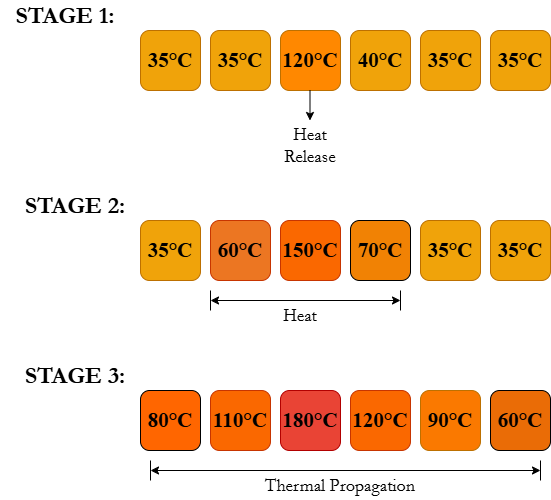

::: container

**THEORY**

## 1. Electric Vehicle Battery Pack

The battery pack is the primary energy source of an electric vehicle and
consists of multiple lithium-ion cells connected together to meet the
required voltage and energy demands.

During charging and discharging, battery cells generate heat as a part
of normal operation.

To ensure safe operation, EV battery packs are equipped with cooling and
protection systems that help maintain the battery within its safe
operating limits.

Failure of a single battery cell can affect the performance and safety
of the entire battery pack, making thermal management an important
aspect of EV design.

---

## 2. Basic Terminologies

### Battery Management System (BMS)

The Battery Management System continuously monitors battery voltage,
current, and temperature.

It helps detect abnormal conditions and activates protection mechanisms
whenever necessary.

### Thermal Runaway

Thermal runaway occurs when a battery generates heat faster than it can
dissipate it.

As the temperature rises, internal chemical reactions accelerate and
generate even more heat, causing a continuous increase in temperature.

### Thermal Runaway Propagation

Heat released from a failed cell can spread to neighbouring cells.

If neighbouring cells also reach unsafe temperatures, the failure can
propagate throughout the battery pack.

### Emergency Battery Isolation System (EBIS)

The Emergency Battery Isolation System disconnects the faulty battery
section from the rest of the battery pack once unsafe conditions are
detected.

This helps limit the spread of thermal faults and protects healthy
battery modules.

---

## 3. Governing Thermodynamic Equations

### A. Internal Heat Generation

When current pumps through a battery, the internal resistance of the
cell acts like a tiny heater, turning electrical energy into heat via
Joule heating.

We calculate that heat using:

**Q = I2Rt**

---

Q : Heat generated (J) 
I : Current flow (A) 
R : Internal resistance (Ω) 
t : Time duration (s)

---

### B. Cell Temperature Escalation

The heat trapped inside the physical mass of the cell makes its
temperature rise.

If the coolant isn\'t clearing it fast enough, the direct temperature
jump is tracked with the standard sensible heat formula:

**Q = mcΔT**

---

Q : Stored heat energy (J) 
m : Mass of the individual cell (g) 
c : Specific heat capacity (J/kg · K) 
ΔT : Temperature change (°C or K) 

---

### C. Conductive Heat Transfer (Propagation)

The structural heat bleed from a hot cell to a cold cell over an
isolation barrier relies entirely on thermal conduction.

The actual rate of this energy leak is governed by Fourier\'s Law:

**Q = -kA(dT/dx)**

---

Q : Heat transfer rate (W) 
k : Thermal conductivity of the material (W/m · K) 
A : Available surface contact area (m2) 
dT/dx : Spatial temperature gradient across the barrier 

### WORKFLOW

:::
